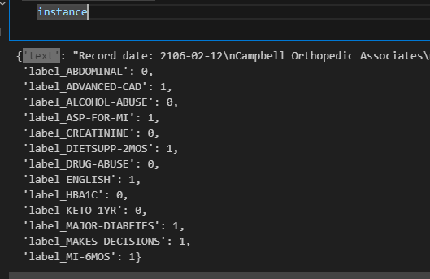
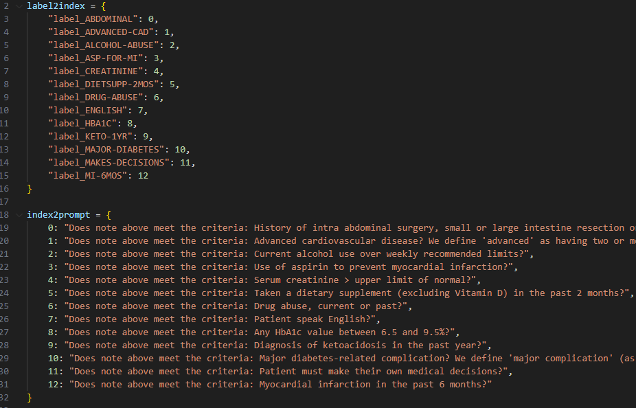

# ClinicalMamba

This repository contains the implementation of prompt-based fine-tuning ClinicalMamba on n2c2 2018 shared task 1: [Cohort Selection for Clinical Trials](https://www.semanticscholar.org/paper/Cohort-selection-for-clinical-trials%3A-n2c2-2018-1-Stubbs-Filannino/29dfdb6bf2b44ea57525a6b89b72cb74413fb5a5). 
This is a classification task that identifies which patients meet and do not meet the identified selection criteria given in their longitudinal clinical notes.

The ClinicalMamba: A Generative Clinical Language Model on Longitudinal Clinical Notes paper contains 2 unique ClinicalMamba models with different number of parameters: [clinicalmamba-2.8b-hf](https://huggingface.co/whaleloops/clinicalmamba-2.8b-hf) and [clinicalmamba-130m-hf](https://huggingface.co/whaleloops/clinicalmamba-130m-hf).


## Dependencies

* python=3.9.18
* numpy=1.26.3
* transformers=4.36.2
* tokenizers=0.15.0
* mamba-ssm=1.1.2
* causal-conv1d=1.1.1
* pytorch=2.1.2
* pytorch-cuda=12.1
* scikit-learn=1.4.0 

Full environment setting is lised [here](conda-environment.yaml) and can be installed through:

```
conda env create -f conda-environment.yaml
conda activate mixtral
```

## Download / preprocess data
1. Download [raw n2c2 data folder](https://portal.dbmi.hms.harvard.edu/projects/n2c2-nlp/) train and n2c2-t1_gold_standard_test_data, and put them under ./data
2. Proprcesss the data by running the notebook: ./preprocess/preprocess.ipynb. It will transform from xml to json format, where each instance is a dictionary input is 'text' and output should start with ‘label’. Example in image below:

3. Define your labels and associated prompts here ./config_labels.py. Example in image below:

4. The model then learns to assign token yes or no to each prompt.


## Train and Eval

To finetune on Cohort Selection for Clinical Trials with 2.8b model:
```
CUDA_VISIBLE_DEVICES=0 python main-hf.py \
                --seed 3407 --data_seed 3407 --ddp_find_unused_parameters False \
                --data_path ./data \
                --config_name whaleloops/clinicalmamba-2.8b-hf \
                --tokenizer_name whaleloops/clinicalmamba-2.8b-hf \
                --model_name_or_path whaleloops/clinicalmamba-2.8b-hf \
                --do_train --do_eval --max_seq_length 15004 \
                --per_device_train_batch_size 1 --gradient_accumulation_steps 8 --per_device_eval_batch_size 1 \
                --adam_beta1 0.9 --adam_beta2 0.95 --adam_epsilon 1e-5  \
                --learning_rate 0.000245 --weight_decay 1e-2 --num_train_epochs 12 \
                --lr_scheduler_type linear --warmup_ratio 0.15 \
                --logging_steps 50 \
                --evaluation_strategy epoch --save_strategy no \
                --logging_first_step \
                --output_dir ./saved_models/clinicalmamba-test01-hf
```


For 130m model
```
CUDA_VISIBLE_DEVICES=0 python main-hf.py \
                --seed 3407 --data_seed 3407 --ddp_find_unused_parameters False \
                --data_path ./data \
                --config_name PATH_TO_HF_MODEL/clinicalmamba-130m-hf \
                --tokenizer_name PATH_TO_HF_MODEL/clinicalmamba-130m-hf \
                --model_name_or_path PATH_TO_HF_MODEL/clinicalmamba-130m-hf \
                --do_train --do_eval --max_seq_length 15004 \
                --per_device_train_batch_size 2 --gradient_accumulation_steps 4 --per_device_eval_batch_size 2 \
                --adam_beta1 0.9 --adam_beta2 0.95 --adam_epsilon 1e-5  \
                --learning_rate 0.000445 --weight_decay 1e-2 --num_train_epochs 12 \
                --lr_scheduler_type linear --warmup_ratio 0.15 \
                --logging_steps 50 \
                --evaluation_strategy epoch --save_strategy no \
                --logging_first_step \
                --output_dir ./saved_models/clinicalmamba-test02-hf
```


## Citation
```
@misc{yang2024clinicalmamba,
      title={ClinicalMamba: A Generative Clinical Language Model on Longitudinal Clinical Notes}, 
      author={Zhichao Yang and Avijit Mitra and Sunjae Kwon and Hong Yu},
      year={2024},
      eprint={2403.05795},
      archivePrefix={arXiv},
      primaryClass={cs.CL}
}
```

## License

See the [LICENSE](LICENSE) file for more details.
